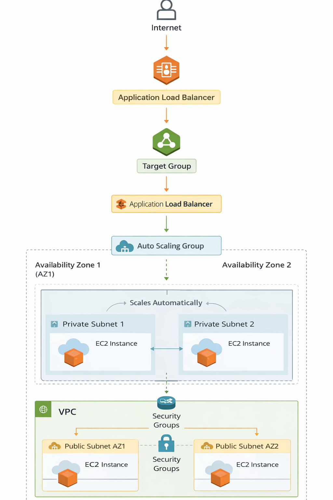

## Project Preview

<p align="center">
  
</p>

# Scalable Portfolio Deployment on AWS (ALB + Auto Scaling)

## Project Overview

This project demonstrates the deployment of a scalable web application infrastructure on AWS using industry-standard DevOps practices.

The architecture ensures:

* High availability
* Automatic scaling
* Load balancing
* Secure networking

The deployed application is a **React-based portfolio website** served through **Nginx on EC2 instances**.

---

## Architecture Diagram



---

# Architecture

The infrastructure uses the following AWS services:

* VPC
* Public and Private Subnets
* Internet Gateway
* NAT Gateway
* Security Groups
* Launch Template
* Auto Scaling Group
* Target Group
* Application Load Balancer

---

## Traffic Flow

User
↓
Application Load Balancer
↓
Target Group
↓
Auto Scaling Group
↓
EC2 Instances
↓
Nginx Web Server
↓
Portfolio Website

The Application Load Balancer distributes incoming traffic across multiple EC2 instances managed by the Auto Scaling Group to ensure high availability and fault tolerance.

---

# Infrastructure Components

### VPC

Custom VPC created to isolate infrastructure resources.

### Subnets

* 2 Public Subnets (for Load Balancer)
* 2 Private Subnets (for EC2 instances)

### Internet Gateway

Provides internet connectivity to the VPC.

### NAT Gateway

Allows private EC2 instances to access the internet securely.

### Security Groups

Configured to allow:

* HTTP/HTTPS access to the Load Balancer
* Internal communication between ALB and EC2 instances

### Launch Template

Defines EC2 instance configuration including:

* Ubuntu AMI
* Instance type
* User data script to install Nginx and deploy the portfolio

### Application Load Balancer

Distributes incoming traffic across EC2 instances.

### Target Group

Registers EC2 instances and performs health checks.

### Auto Scaling Group

Automatically launches and replaces EC2 instances across multiple Availability Zones.

---

# Deployment Process

1. Build React application

```
npm run build
```

2. Push project (including dist folder) to GitHub
3. Launch Template installs dependencies and clones repository
4. Nginx serves the built portfolio application
5. Auto Scaling ensures instance availability

---

# Project Screenshots

Architecture and deployment screenshots are included in the **screenshots** directory.

---

# Billing Proof

AWS billing report included in the **billing** directory confirms real infrastructure usage.

---

# Final Output

The portfolio website is accessible through the **Application Load Balancer DNS**.

---

# Technologies Used

* AWS VPC
* Amazon EC2
* Application Load Balancer (ALB)
* Auto Scaling Group (ASG)
* NAT Gateway
* Security Groups
* Nginx Web Server
* React (Portfolio Application)
* GitHub

---

# Key DevOps Concepts Demonstrated

* Infrastructure design using AWS VPC
* Secure network architecture
* Load balancing with ALB
* Automatic scaling with ASG
* Instance bootstrapping using user-data
* Cloud deployment automation
